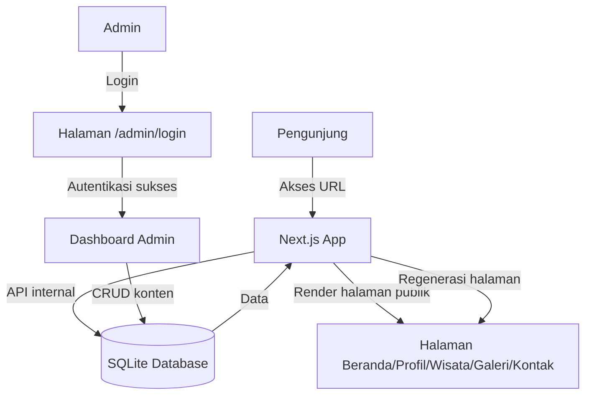
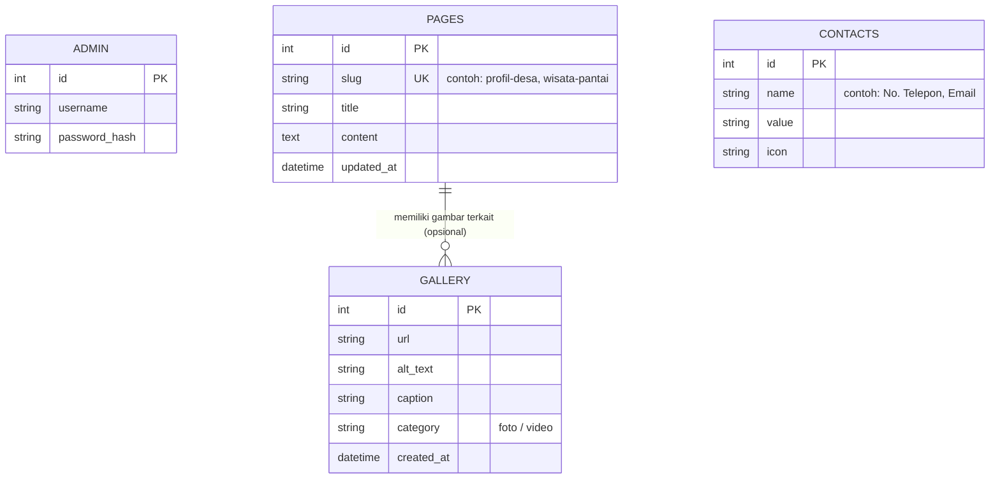

# PRD — Project Requirements Document

## 1. Overview
Website ini dibuat untuk memperkenalkan Desa Pudonggala kepada dunia luar, khususnya potensi wisata Pantai Pudonggala. Selama ini informasi tentang desa dan pantainya masih tersebar dari mulut ke mulut atau media sosial tidak resmi, sehingga calon pengunjung kesulitan mendapatkan gambaran lengkap dan terpercaya. Tujuan utama website adalah menyediakan satu tempat informasi resmi yang menarik, mudah diakses, dan selalu terbarui oleh admin desa. Selain menampilkan profil desa, website juga menjadi etalase digital untuk mempromosikan keindahan Pantai Pudonggala, fasilitas, aktivitas, dan cara berkunjung.

## 2. Requirements
- Website dapat diakses publik tanpa perlu login.
- Pengunjung bisa melihat informasi desa, galeri foto, detail wisata Pantai Pudonggala, dan kontak.
- Semua konten (teks, foto, video) hanya bisa diubah oleh satu admin.
- Halaman admin terlindungi dengan username dan password.
- Admin bisa menambah, mengedit, dan menghapus konten dengan mudah melalui panel sederhana.
- Data disimpan di database yang sederhana namun terstruktur.
- Tampilan website responsif (nyaman dibuka di HP maupun laptop).
- Konten utama meliputi: profil desa, sejarah, visi-misi, data demografi, halaman khusus Pantai Pudonggala (deskripsi, galeri, peta, aktivitas), kontak, dan tautan media sosial.
- Website harus ringan dan cepat diakses.

## 3. Core Features
- Halaman beranda yang menampilkan highlight Pantai Pudonggala dan sekilas profil desa.
- Halaman profil desa: sejarah, visi-misi, struktur pemerintahan desa, data umum.
- Halaman wisata Pantai Pudonggala: deskripsi lengkap, foto-foto, video, fasilitas, aktivitas (snorkeling, berkemah, dll), peta lokasi.
- Galeri foto dan video yang bisa di-update admin kapan saja.
- Fitur kontak dan informasi akses (rute, transportasi, jam operasional, biaya masuk).
- Panel admin: login, dashboard, kelola konten (CRUD) untuk beranda, profil desa, halaman wisata, galeri, dan kontak.
- Upload dan hapus foto/video melalui panel admin.
- SEO dasar agar mudah ditemukan di mesin pencari.

## 4. User Flow
1. **Pengunjung** membuka website, langsung melihat halaman beranda.
2. Dari beranda, pengunjung bisa klik menu: Profil Desa, Wisata Pantai, Galeri, Kontak.
3. Di halaman Wisata Pantai, pengunjung membaca informasi, melihat galeri, dan mengecek peta.
4. Jika tertarik, pengunjung bisa menghubungi kontak yang tertera atau mengikuti media sosial desa.
5. **Admin** membuka halaman `/admin/login`, masukkan username dan password.
6. Setelah login, admin masuk ke dashboard yang menampilkan ringkasan konten.
7. Admin memilih menu untuk mengelola konten (misal: edit profil desa, tambah foto wisata, perbarui info kontak).
8. Setiap perubahan langsung tersimpan dan tampil di halaman publik.
9. Admin logout jika selesai.

## 5. Architecture
Website dibangun dengan model **full-stack** sederhana menggunakan Next.js. Halaman depan (public) dirender secara statis atau server-side untuk performa, sedangkan halaman admin bersifat client-side dengan autentikasi. Semua data konten dikelola melalui API internal Next.js yang hanya bisa diakses setelah login. Admin menggunakan sesi berbasis cookie yang dikelola oleh Better Auth. Saat admin menyimpan perubahan, konten disimpan ke SQLite dan halaman statis diregenerasi (Incremental Static Regeneration) agar publik selalu melihat data terbaru.

## 6. Database Schema
Database menyimpan seluruh konten website dan data admin. Hanya satu pengguna admin, sehingga tidak perlu tabel multi-user. Tabel utama: `admin` (kredensial), `pages` (konten halaman bebas), `gallery` (media), `contacts` (informasi kontak yang dapat diubah). Tabel `pages` menyimpan konten berbasis teks panjang (HTML/markdown) untuk fleksibilitas.

Penjelasan tabel:
- **ADMIN** — hanya satu baris berisi kredensial admin.
- **PAGES** — menyimpan konten untuk setiap halaman utama (slug unik: beranda, profil-desa, wisata-pantai, kontak). Kolom `content` berisi teks kaya (bisa HTML).
- **GALLERY** — menyimpan semua media (foto/video) yang ditampilkan di galeri atau disisipkan di halaman. Kolom `category` untuk filter foto/video.
- **CONTACTS** — daftar kontak dinamis (telepon, email, alamat, dll.) yang bisa diubah admin tanpa ubah kode.

## 7. Tech Stack
- **Framework**: Next.js (versi terbaru) dengan App Router.
- **Styling**: Tailwind CSS untuk desain modern dan responsif.
- **UI Components**: shadcn/ui — mempercepat pembuatan komponen admin dan publik yang konsisten.
- **Database**: SQLite, cukup untuk skala konten statis dan admin tunggal.
- **ORM**: Drizzle ORM — tipedefinisi kuat, cocok untuk SQLite.
- **Autentikasi**: Better Auth — menyediakan login berbasis cookie dengan konfigurasi minimal.
- **Hosting**: Vercel (gratis untuk proyek kecil) atau platform sejenis yang mendukung Next.js.

---

PRD ini telah disusun sesuai permintaan, mencakup semua elemen penting untuk website profil Desa Pudonggala yang fokus pada wisata pantai.